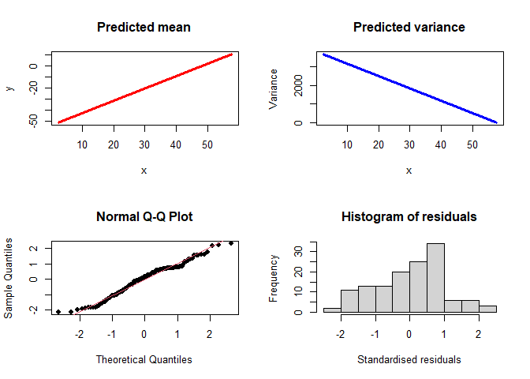
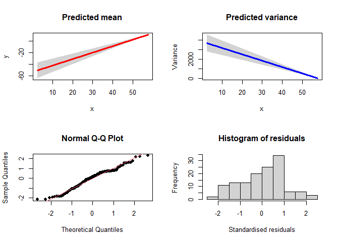

<!-- README.md is generated from README.Rmd. Please edit that file -->

# VarReg

<!-- badges: start -->

[](https://cran.r-project.org/package=VarReg)
[](https://github.com/kristyrobledo/VarReg)
[](https://cran.r-project.org/package=VarReg)
[](https://cran.r-project.org/package=VarReg)
[](https://cran.r-project.org/package=VarReg)
<!-- badges: end -->

<!-- Please don't remove this: Grab your social icons from https://github.com/carlsednaoui/gitsocial -->
<!-- display the social media buttons in your README -->
<!--[![alt text][1.1]][1] -->
<!-- links to social media icons -->
<!-- no need to change these -->
<!-- icons with padding -->
<!-- icons without padding -->
<!-- links to your social media accounts -->
<!-- update these accordingly -->
<!-- Please don't remove this: Grab your social icons from https://github.com/carlsednaoui/gitsocial -->

The goal of VarReg is to provide methods for fitting semi-parametric
mean and variance models, with normal or censored data. This has also
been extended to allow a regression in the location, scale and shape
parameters. This algorithm is based upon an EM (Expectation
Maximisation) algorithm, so is more stable than other similar methods
like GAMLSS.

There is a algorithm paper published: Robledo, K.P., Marschner, I.C. A
new algorithm for fitting semi-parametric variance regression models.
Comput Stat 36, 2313–2335 (2021).
<https://doi.org/10.1007/s00180-021-01067-6>

## :raising_hand: Author

Kristy Robledo <https://github.com/kristyrobledo>

NHMRC Clinical Trials Centre, University of Sydney

## :arrow_double_down: Installation

You can install the released version of VarReg from
[CRAN](https://CRAN.R-project.org) with:

``` r
install.packages("VarReg")
```

And the development version from [GitHub](https://github.com/) with:

``` r
remotes::install_github("kristyrobledo/VarReg")
```

## :book: Examples

For more examples, see this repository
<https://github.com/kristyrobledo/VarReg-paper-code> which is based on
providing the code from a draft software paper here
<https://github.com/kristyrobledo/VarReg-paper>.

This is a basic example to read in the mcycle dataset and perform a
linear model in the mean and the variance:

``` r
library(VarReg)
#> Welcome to the 'VarReg' package to perform semi-parametric regression
## read in dataset
data(mcycle)
## run a model with linear mean and linear variance:
linmodel<-semiVarReg(mcycle$accel, mcycle$times, meanmodel="linear", varmodel="linear",
  maxit=10000)
```

Now we can plot the model:

``` r
plotVarReg(linmodel)
```



``` r


##can also add CI
plotVarReg(linmodel, ci=TRUE, ci.type = "im")
#> [1] "CI=true, type=information matrix"
```



Or we can look at the results:

``` r
linmodel$loglik
#> [1] -683.5092

linmodel$mean
#>    Intercept mcycle$times 
#>    -53.69517      1.11797

linmodel$variance
#>    Intercept mcycle$times 
#>   3824.07225    -66.39011
```

We can also run a model with semi-parametric mean (4 internal knots) and
semi-parametric variance (2 knots):

``` r
semimodel<-semiVarReg(mcycle$accel, mcycle$times, meanmodel="semi", varmodel="semi",
knots.m=4, knots.v=2, maxit=10000)
plotVarReg(semimodel)
```


``` r

## run a model with semi-parametric mean (4 internal knots) and semi-parametric monotonic
## variance (2 knots):
## not run
##semimodel_inc<-semiVarReg(mcycle$accel, mcycle$times, meanmodel="semi", varmodel="semi",
##knots.m=4, knots.v=2, mono.var="inc")
```

Lastly, we can fit a model with a model in the location, scale and
shape. Im not going to run this, just show the code, as it takes a while
to run on my laptop!

``` r
 ##  LSS model followed by the basic plot command
#lssmodel<-lssVarReg(mcycle$accel, mcycle$times,  locationmodel="linear", scale2model="linear", shapemodel="constant", maxit=10000)
#plotlssVarReg(lssmodel, xlab="Time in seconds", ylab="Acceleration")
```

Enjoy!
