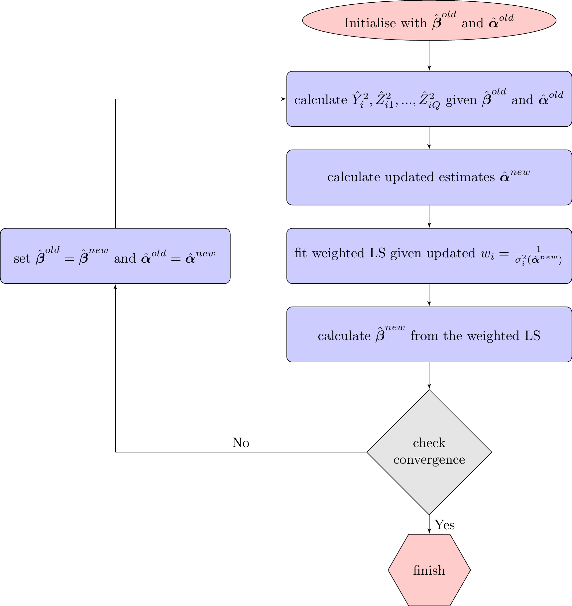

There are three main algorithms within the package. 

1. models for the mean and the variance
2. models for the mean and the variance, taking into account censoring of the outcome variable
3. models for the location, scale and shape

Here we will discuss some of the specifics of each of these algorithms. 

# Mean and Variance models

The statistical methods for the mean and variance model given in Robledo and Marschner [-@Robledo2021]. Briefly, let a set of covariates be included on which the mean depends be $P$, giving $\boldsymbol{z}_i = (z_{i1}, \dots, z_{iP})^T$ and the number of covariates on which the variance depends be $Q$ giving $\boldsymbol{x}_i = (x_{i1}, \dots, x_{iQ})^T$. This leads to the general model 

\begin{align}
X_i \sim N\left(\boldsymbol{\beta}^T \boldsymbol{z} , \boldsymbol{\alpha}^T \boldsymbol{x} \right) \quad \textrm{for }\quad i=1, 2,...,n  (\#eq:general) 
\end{align}

where $\boldsymbol{\beta} =( \beta_0,...,\beta_P)^T$ and $\boldsymbol{\alpha} = (\alpha_0, ..., \alpha_Q)^T$.  The mean is estimated using linear regression, weighted by the inverse of the current estimate of the variance. The covariates ($\boldsymbol{z}_i$) are fit in this model, and updated estimates of $\boldsymbol{\hat\beta}_i$ are obtained, where $\hat{\boldsymbol{\beta}}=(\hat{\beta}_0, .., \hat{\beta}_P)$. This additional step to fit the mean model in both the E-step and M-step converts the EM algorithm to a ECME (Expectation Conditional Maximization Either) algorithm [@Liu1994;@McLachlan1997], and is given in Figure \@ref(fig:ecmemean) below.

By using the idea that the additive variance model is considered to be a latent outcome model in which the observed outcome is the sum of independent outcomes, we allow each member of the covariate vector $\boldsymbol{x}_i$ to be additional latent variables to be estimated. Therefore, with a total of $Q$ variables in the variance model, there are $Q+1$ independent, unobserved, latent variables, 
\begin{align*}
 Y_{i} \sim N(\boldsymbol{\beta} \boldsymbol{z}, \alpha_0 ) \textrm{,    } \quad
 Z_{iq} \sim N(0, \alpha_q x_{iq}) ,
\end{align*}
where $X_i=Y_i+Z_{i1}+...+Z_{iQ}$. 

In order to search the entire parameter space, a process of using sets of constrained EM algorithms are performed, an instance of a combinatorial EM (CEM) algorithm. Without loss of generality, assume that each covariate is scaled such that $x_{i} \in [0,1]$. Therefore, the constant term in the variance model ($\alpha_0$) will be the variance when all other variance parameters are zero. In order to search for non-positive slope, an EM algorithm is fit using the covariate $1-x_i$ in place of $x_i$, and thus the EM algorithm is maximising the log-likelihood over the parameter space estimates for $\alpha_0 \geq 0$ and $\alpha_q < 0$ for $q=1,2,...,Q$. By repeating this for all possible covariate combinations, we have a total of $2^Q$ EM algorithms in order to search the entire parameter space. The MLE will then be the $\hat{\boldsymbol{\theta}}$ from the EM algorithm that achieved the highest log-likelihood, where $\boldsymbol{\theta}$ is a vector of unknown parameters, $\boldsymbol{\theta} = (\boldsymbol{\beta},\boldsymbol{\alpha})$. These $2^Q$ models are referred to as the family of complete data models, and the general algorithm is again an instance of a CEM algorithm. Standard errors are obtained from the Fisher information matrix [@Robledo2021], or by bootstrapping. 

The ECME algorithm for the estimation of the mean and variance

# Mean and Variance models with censored outcome data

Censoring often occurs in the analysis of biomarker data, where the samples are measured with an assay that usually have detectable limits, with data at both upper and lower limits reached.  When biomarker data can be below the detectable limit (left censored), and/or above the detectable limit (right censored), differences between two biomarker readings will also be censored. We need to be able to accurately model such data, particularly with a steady increase in the numbers of biomarkers investigated in clinical trials, and potentially large amounts of data above or below detectable limits. Some studies report over one-third of their biomarker data as below the detectable limit [@White2014]. 

If $X_i^*$ is our true outcome data, let $X_i$ be the outcome data observed with censoring, and let us account for lower and upper limit censoring for completeness. This censored data given an additional level of missingness in our CEM algorithm, and thus an extra level of our complete data. If $X^{(L)}$ is the lower limit of detection and $X^{(U)}$ is the upper limit then
\begin{align}
    X_i = 
\begin{cases}
    X_i^*,			& \text{if } X^{(L)} \leq X_i^* \leq X^{(U)}\\
    X^{(L)},        & \text{if } X_i^* < X^{(L)} \quad\quad \quad
    \textrm{for  } i = 1,2 .., n.\\
    X^{(U)}, 		& \text{if } X_i^* > X^{(U)}
\end{cases} (\#eq:xi)
\end{align}

We will also need to specify $c$, the censoring indicator, where

\begin{align*}
    c_i = 
\begin{cases}
    0,			& \text{if } X^{(L)} \leq X_i^* \leq X^{(U)}\\
    -1,        & \text{if } X_i^* < X^{(L)}\\
    1, 		& \text{if } X_i^* > X^{(U)}.
\end{cases}
\end{align*}

Assuming still that the covariates $x_{iq}$ are scaled such that $x_{iq} \in [0,1]$, let us now fit the same model as Equation \@ref(eq:general) however with $X_i^*$ as our outcome data. 
If $\Phi$ is the standard normal cumulative distribution function and $\phi$ is the standard normal probability density function, then two useful functions are $R(z)=\dfrac{\phi(z)}{1-\Phi(z)}$ and $Q(z)=\dfrac{-\phi(z)}{\Phi(z)}$ [@Mills1926]. Additionally, when $z$ tends to negative infinity, the approximation $\dfrac{\phi(z)}{\Phi(z)} \approx -z$ can be used.
The likelihood function for the observed data model with censored data is 
\begin{align*}
    l(\boldsymbol{\beta, \alpha}) = \prod_{i=1}^{N} l_i
\end{align*}
where 
\begin{align*}
l_i = 
\begin{cases}
    \displaystyle \frac{1}{\sigma(\boldsymbol{\alpha})} \phi \left( \frac{X_i-\mu(\boldsymbol{\beta}))}{\sigma(\boldsymbol{\alpha})} \right)  ,			& \text{if } c_i=0\\
     \displaystyle 1- \Phi \left( \frac{\mu(\boldsymbol{\beta}) - X_i^{(L)}}{\sigma(\boldsymbol{\alpha})} \right)  ,        & \text{if } c_i=-1\\
     \displaystyle \Phi \left( \frac{\mu(\boldsymbol{\beta}) - X_i^{(U)}}{\sigma(\boldsymbol{\alpha})} \right)  ,        & \text{if } c_i=1. 
\end{cases}
\end{align*}
The corresponding log-likelihood is then 
\begin{align*}
    \ell(\boldsymbol{\beta, \alpha}) =  \sum_{i=1}^{N} \ell_i, 
\end{align*}
where
\begin{align*}
\ell_i =
\begin{cases}
    \displaystyle \log \left( \frac{1}{\sigma(\boldsymbol{\alpha})} \phi \left( \frac{X_i- \mu(\boldsymbol{\beta})}{\sigma(\boldsymbol{\alpha})} \right)  \right),			& \text{if } c_i=0\\
     \displaystyle \log \left( 1- \Phi \left( \frac{\mu(\boldsymbol{\beta}) - X_i^{(L)}}{\sigma(\boldsymbol{\alpha})} \right) \right) ,        & \text{if } c_i=-1\\
     \displaystyle \log \left( \Phi \left( \frac{\mu(\boldsymbol{\beta}) - X_i^{(U)}}{\sigma(\boldsymbol{\alpha})} \right)  \right),        & \text{if } c_i=1. 
\end{cases}
\end{align*}
Now in the CEM algorithm, the uncensored outcome variable $X_i^*$ will be assumed to be composed of $Q+1$ independent, unobserved, latent variables: 
\begin{align}
X_i^* =Y_i+Z_{i1}+...+Z_{iQ} \quad \textrm{where}  \quad
Y_i &\sim N(0, \alpha_0) \quad \textrm{and}  \nonumber \\
 Z_{i1} &\sim N(0,  \alpha_1x_{i1})  ,..., Z_{iQ} \sim N(0,  \alpha_Qx_{iQ}). (\#eq:clatents)
\end{align}
This means that we will need to find the conditional expectations of $Y_i^2$ and $Z_{i1}^2, ...,  Z_{iQ}^2$, given the observed outcome value, $X_i$, which may be censored. 

From [@Aitkin1964], we see that for bivariate normal variables $M$ and $N$, where
\begin{align*}
\begin{pmatrix}M\\
N
\end{pmatrix} &\sim  N
\begin{bmatrix}
\begin{pmatrix}
0\\
0
\end{pmatrix}\!\!, 
\begin{pmatrix}
1 & \rho \\
\rho & 1 
\end{pmatrix}
\end{bmatrix}, 
\end{align*}
the conditional distribution for $M$ given censoring in $N$ can be obtained. In particular, given an upper limit, $a$, it was shown that: 
\begin{align}
\mathbb{E}(M^2 \mid N>a) = \frac{a\rho^2}{R(a)}+1, (\#eq:fcensor)
\end{align}
where $\rho$ is the correlation between $M$ and $N$ and $R(a)$ was defined previously. We know from Equation \@ref(eq:clatents) that the variance for $Y_i$ is $\alpha_0$, and the variance for $X_i$ is $\sigma^2(\boldsymbol{\alpha})$. So, given Equation \@ref(eq:clatents) and the general result in Equation  \@ref(eq:fcensor), it follows that, 
\begin{align}
\mathbb{E}(Y_i^2 \rvert X_i>X^{(U)}) &=\alpha_0 \mathbb{E}\left( \dfrac{Y_i^2}{{\alpha_0}} \rvert \dfrac{X_i}{\sigma(\boldsymbol{\alpha})}>\dfrac{X^{(U)}}{\sigma(\boldsymbol{\alpha})}\right), \nonumber \\
&=\alpha_0  \left( \dfrac{\dfrac{X^{(U)}}{\sigma(\boldsymbol{\alpha})} Corr(Y_i,X_i)^2 }{ R\left(\dfrac{X^{(U)}}{\sigma(\boldsymbol{\alpha})}\right)} +1 \right). (\#eq:fcens2) 
\end{align}
We can then determine the correlation between $Y_i$ and $X_i$:
\begin{align}
Corr(Y_i, X_i) &= \dfrac{cov(Y_i, X_i)}{\sqrt{ \alpha_0\sigma^2(\boldsymbol{\alpha})}} \nonumber \\
&=  \dfrac{cov(Y_i,Y_i+Z_i)}{\sqrt{ \alpha_0\sigma^2(\boldsymbol{\alpha})}} \nonumber\\
&= \dfrac{cov(Y_i, Y_i)+cov(Y_i,Z_i)}{\sqrt{ \alpha_0\sigma^2(\boldsymbol{\alpha})}} \nonumber\\
&= \dfrac{\alpha_0+0}{\sqrt{ \alpha_0\sigma^2(\boldsymbol{\alpha})}}, \nonumber \\
&= \dfrac{\sqrt{\alpha_0}}{\sigma(\boldsymbol{\alpha})}. (\#eq:rho1)
\end{align}
We can also determine the correlation for each of the $Z_{iq}$ and $X_i$, using a similar argument:
\begin{align}
Corr(Z_{iq}, X) &= \dfrac{\sqrt{\alpha_qx_{iq}}}{\sigma(\boldsymbol{\alpha})}. (\#eq:rho2)
\end{align}
Now we apply the correlation found in Equation \@ref(eq:rho1) to Equation \@ref(eq:fcens2), in order to obtain our conditional expectation of $Y_i^2$:
\begin{align}
\mathbb{E}(Y_i^2 \rvert X_i>X^{(U)}) &=\alpha_0  + \dfrac{\alpha_0^2 X^{(U)}}{\sigma^3(\boldsymbol{\alpha}) R\left(\dfrac{X^{(U)}}{\sigma_X}\right)}. (\#eq:exp1)
\end{align}
The expectation of each of the $Z_{iq}^2$ follows the same argument, using Equation \@ref(eq:rho2). 

In order to apply these expectations to left censored data, we use the function $Q(z)$ rather than $R(z)$. For censored outcome data, the E-step involves the calculation of the conditional expectations as defined above:

\begin{align}
    \hat{Y}_i^2(\boldsymbol{\theta}) = 
\begin{cases}
    \displaystyle \alpha_0+\dfrac{\alpha_0^2}{\sigma^2(\boldsymbol{\alpha})}\left( \dfrac{\left(\dfrac{X_i- \mu(\boldsymbol{\beta})}{\sigma(\boldsymbol{\alpha})}  \right)^2}{\sigma(\boldsymbol{\alpha})} -1\right),			& \text{if } c_i=0 \\
     \displaystyle \alpha_0+\dfrac{\alpha_0^2}{\sigma^2(\boldsymbol{\alpha})}\left( \dfrac{\dfrac{ X_i- \mu(\boldsymbol{\beta})}{\sigma(\boldsymbol{\alpha})}}{Q\left(\dfrac{ X_i- \mu(\boldsymbol{\beta})}{\sigma(\boldsymbol{\alpha})}\right)}\right) ,        & \text{if } c_i=-1 \\
     \displaystyle \alpha_0+\dfrac{\alpha_0^2}{\sigma^2(\boldsymbol{\alpha})}\left( \dfrac{\dfrac{ X_i- \mu(\boldsymbol{\beta})}{\sigma(\boldsymbol{\alpha})}}{R\left(\dfrac{ X_i- \mu(\boldsymbol{\beta})}{\sigma(\boldsymbol{\alpha})}\right)}\right),        & \text{if } c_i=1,
\end{cases} (\#eq:calcyicens)
\end{align}

remembering that $\boldsymbol{\theta}=(\boldsymbol{\beta},\boldsymbol{\alpha})$, and $X_i$ is defined in Equation \@ref(eq:xi). The conditional expectations associated with the $Z_{iq}$ follow the same principles,  

\begin{align}
\hat{Z}_{iq}^2(\boldsymbol{\theta}) = 
\begin{cases}
    \displaystyle \alpha_q x_{iq}+\dfrac{\left( \alpha_q x_{iq} \right)^2}{\sigma^2(\boldsymbol{\alpha})}\left( \dfrac{\left( \dfrac{X_i- \mu(\boldsymbol{\beta})}{\sigma(\boldsymbol{\alpha})} \right)^2}{\sigma(\boldsymbol{\alpha})} -1 \right),			& \text{if } c_i=0\\
     \displaystyle \alpha_q x_{iq}+\dfrac{\left( \alpha_q x_{iq} \right)^2}{\sigma^2(\boldsymbol{\alpha})}\left( \dfrac{\dfrac{ X_i- \mu(\boldsymbol{\beta})}{\sigma(\boldsymbol{\alpha})}}{Q\left( \dfrac{ X_i- \mu(\boldsymbol{\beta})}{\sigma(\boldsymbol{\alpha})}\right) } \right) ,        & \text{if } c_i=-1\\
     \displaystyle \alpha_q x_{iq}+\dfrac{\left( \alpha_q x_{iq} \right)^2}{\sigma^2(\boldsymbol{\alpha})}\left( \dfrac{\dfrac{ X_i-\mu(\boldsymbol{\beta})}{\sigma(\boldsymbol{\alpha})}}{R\left(\dfrac{ X_i- \mu(\boldsymbol{\beta})}{\sigma(\boldsymbol{\alpha})}\right) }\right),        & \text{if } c_i=1. 
\end{cases} (\#eq:calczicens)
\end{align}

The next step of the algorithm involves calculating the updated estimates of $\boldsymbol{\theta}$, $\boldsymbol{\hat{\theta}}^{new}$.  The estimates for $\hat{\boldsymbol{\alpha}}$ for fixed $\boldsymbol{\beta}$ are obtained by the following,

\begin{align}
\hat \alpha_0^{new}=n^{-1} \sum\limits_{i=1}^n \hat Y_i^2 \left( \hat{\boldsymbol{\theta}}^{old} \right) \quad
\textrm{and} \quad
\hat{\alpha}_q^{new}= \frac{\sum\limits_{i=1}^n  \hat{Z}_{iq}^2 (\boldsymbol{\theta}^{old})}{n \sum\limits_{i=1}^n  x_{iq}}. (\#eq:censupdatealpha)
\end{align}

Previously in the mean and variance model [@Robledo2021], a weighted linear regression was fit in order to obtain an updated estimate of the mean parameters ($\hat{\boldsymbol{\beta}}$) at each iteration, for fixed $\boldsymbol{\alpha}=\boldsymbol{\hat{\alpha}}^{new}$. In order to estimate the mean model with censored outcome data, we need to fit a heteroscedastic censored linear regression model. This can be achieved by first standardizing the data, and then performing a homoscedastic censored linear regression at each iteration. In order to standardize the data, we divide by the standard deviation to obtain

\begin{align}
\frac{X_i}{\sigma(\boldsymbol{\alpha})} \sim \textrm{censored } N\left( \dfrac{\mu(\boldsymbol{\beta})}{\sigma(\boldsymbol{\alpha})} ,1\right).  (\#eq:censoutcome)
\end{align}

A homoscedastic censored linear regression for $\dfrac{X_i}{\sigma(\boldsymbol{\alpha})}$ is then performed, against covariates $\dfrac{z_{ip}}{\sigma(\boldsymbol{\alpha})}$, for fixed $\boldsymbol{\alpha}=\boldsymbol{\hat{\alpha}}^{new}$. This can easily be implemented in standard software for censored normal linear regression, which can be performed with `survreg` in R. Once the censored regression is performed, the $\boldsymbol{\hat{\beta}}$ estimates are back transformed by multiplying by the standard deviation $\sigma(\boldsymbol{\alpha})$ for our current fixed $\boldsymbol{\alpha}$. This process is continued until convergence of the parameter estimates. 

This algorithm is an instance of the ECME algorithm, and is summarised schematically in Figure xx. As detailed in Section xxx and xxx, the algorithm maximises the log-likelihood over a restricted parameter space, and will need to be run multiple times in order to maximise over the full parameter space. Thus a total of $2^Q$ ECME algorithms must be run, once for each combination of the $q^{th}$ variance covariate taking the value $x_{i}$ or $1-x_{i}$, for $q=1,2,...,Q$. The log-likelihood is then maximised over the entire parameter space with this family of ECME algorithms. 

The ECME algorithm for the estimation of the mean and variance with censored outcome data

Standard errors are implemented by bootstrapping. In practice, this may take some time for datasets with many parameters fit in the variance model. This is due to the number of parameter spaces, and thus ECME algorithms, that must be run.

# Models for the location, scale and shape

## Skew-normal distribution

The skew-normal distribution is a distribution that extends the normal distribution to allow for non-zero skew [@Azzalini2013]. This distribution has three parameters, the location parameter $\xi$ ($\xi \in (-\infty, \infty)$), the scale parameter $\omega$ ($\omega \in (0, \infty)$) and the shape parameter $\nu$ ($\nu \in (-\infty, \infty)$). If $\nu<0$, the distribution is left skewed, and if $\nu >0$ then the distribution is right skewed. The normal distribution is recovered with $\nu=0$.

The probability density function of the skew normal is  

\begin{align*}
f(x)= \frac{2}{\omega}\phi \left( \frac{x-\xi}{\omega} \right)\Phi \left(\nu \left(\frac{x-\xi}{\omega}\right) \right)\quad -\infty < x < \infty
\end{align*}

where $\phi$ and $\Phi$ are the density and distribution functions of the standard normal distribution, respectively. 
If a random variable $X$ has a skew-normal distribution with parameters $(\xi, \omega, \nu)$, this is written as 

\begin{align*}
X \sim  SN\left(\xi, \omega^2, \nu\right).
\end{align*}

## Maximum likelihood estimation

If $X_1, ..., X_n$ are independent and identically distributed observations from $SN(\xi, \omega^2, \nu)$, the likelihood function for the sample is given as 
\begin{align}
\mathcal{L}(\xi, \omega, \nu)=\frac{2^n}{\omega^n} \prod\limits_{i=1}^n \phi \left(\frac{X_i-\xi}{\omega} \right) \Phi \left( \nu \left( \frac{X_i-\xi}{\omega}\right) \right), (\#eq:llsn)
\end{align}
and the corresponding log-likelihood (omitting the constant term) reduces to
\begin{align}
L(\xi, \omega, \nu)=- n\log(\omega) + \sum\limits_{i=1}^n \log \phi \left(\frac{X_i-\xi}{\omega}\right) + \sum\limits_{i=1}^n  \log \Phi \left(\nu \left(\frac{X_i-\xi}{\omega}\right) \right). 
\end{align}

As will be explained below, the likelihood in Equation \@ref(eq:llsn) is a censored Gaussian likelihood when viewed as a function of $\xi$ and $\omega$, and a probit regression likelihood when viewed as a function of $\nu$. This is useful as it allows a straightforward cyclic coordinate ascent algorithm to be used to obtain the MLE. For optimisation of a multi-variable function, a cyclic coordinate ascent algorithm involves the optimisation of a function with respect to one variable holding the other variables constant, and then repeating with respect to each of the variables [@Lange2013]. In our context, the cyclic coordinate ascent algorithm will cycle between a censored Gaussian model (keeping $\nu$ constant), and a probit regression (keeping $\xi$ and $\omega$ constant).  

Although there already exists an algorithm for obtaining the MLE in the skew-normal model in the `SN` package [@Azzpackage] in R, we introduce this new method as it more easily generalises to regression modelling. 

In order to see that \@ref(eq:llsn) is equivalent to a probit regression likelihood when viewed as a function of $\nu$ alone, we note that \@ref(eq:llsn) is proportional to the following function of $\nu$,
\begin{align}
\mathcal{L}_2(\nu|\xi, \omega) &=  \prod_{i=1}^n \Phi \left( \nu \left( \frac{X_i-\xi}{\omega}\right) \right).  (\#eq:l2)
\end{align}
Now let the residuals be defined as follows, for fixed $\xi$ and $\omega$,
\begin{align*}
r_i = \frac{X_i-\xi}{\omega}. 
\end{align*}

Then, \@ref(eq:l2) is
\begin{align*}
\mathcal{L}_2(\nu|\xi, \omega) &=  \prod_{i=1}^n \Phi \left( \nu r_i \right) =
\prod_{r_i \geq 0} \Phi(\nu |r_i|) \prod_{r_i < 0} \left[ 1-\Phi(\nu |r_i|) \right].
\end{align*}
This is exactly a probit regression likelihood with the binary outcome 
\begin{align*}
    V_i = 
\begin{cases}
    \displaystyle 1			& \text{if } r_i \geq 0\\
     \displaystyle 0        & \text{if } r_i<0
\end{cases}
\end{align*}
and the linear predictor being $\nu |r_i|$. Thus, for fixed $\xi$ and $\omega$, \@ref(eq:llsn) can be maximised as a function of $\nu$ by fitting a probit regression on the binary outcome $V_i$, with no intercept and a single covariate $|r_i|$.

Next, let us look at the estimation of the $\xi$ and $\omega$ parameters, holding $\nu$ constant. If we examine \@ref(eq:llsn), we will now show how this can be considered to be a censored Gaussian likelihood, where the first component is with regards to the uncensored data, and the second component is with regards to the censored data (and multiplied by our constant $\nu$). Note as well, that each observation contributes to both the censored and uncensored components of the likelihood.

For the purpose of performing a censored regression, we will utilise the algorithm developed above for censored outcome data. In order to make use of this algorithm, the data needs to be manipulated to ensure that each observation is contributing to both components of the likelihood. Firstly, we create a censoring indicator, $c$, of length $2n$. The first $n$ elements are set to $0$, and then elements $n+1, ..., 2n$ are set to $-1$ to indicate left censoring. Next, we create a vector of $1$s called $I$ of length $2n$, and we also create a new outcome vector called $D$, where observations $1, ..., n$ are $X$, and observations $n+1, ..., 2n$ are also $X$.  This corresponds to 
\[ D=
\left( \begin{array}{c}
    X_1      \\
    \vdots \\
    X_n \\
    X_1 \\
    \vdots \\
    X_n     
\end{array} \right), ~~~
I= 
\left( \begin{array}{c}
    1      \\
    \vdots \\
    1    \\
    1 \\ 
    \vdots \\
    1    
\end{array} \right), ~~ \text{and} ~~
c= 
\left( \begin{array}{c}
    0      \\
    \vdots \\
    0    \\
    1 \\ 
    \vdots \\
    1    
\end{array} \right).
\]
Now, the likelihood for the observed data model is
\begin{align*}
l(\xi, \omega | \nu) = \prod_{i=1}^{2n} l_i ,
\end{align*}
where
\begin{align*}
l_i= 
\begin{cases}
    \displaystyle  \frac{1}{\omega} \phi \left( \frac{D_i-I_i}{\omega} \right)  ,			& \text{if } c_i=0 \\
     \displaystyle 1- \Phi \left( \nu \left( \frac{I_i - D_i}{\omega}\right)  \right)  ,        & \text{if } c_i=-1, 
\end{cases}
\end{align*}
which equates to
\begin{align}
l_i= 
\begin{cases}
    \displaystyle  \frac{1}{\omega} \phi \left( \frac{D_i-I_i}{\omega} \right)  ,			& \text{if } c_i=0 \\
     \displaystyle  \Phi \left( \nu \left( \frac{D_i-I_i}{\omega} \right) \right)  ,        & \text{if } c_i=-1.
\end{cases} (\#eq:ll2)
\end{align}
Now we can compare Equations \@ref(eq:llsn) and \@ref(eq:ll2), and see that they follow a similar form, where $D_i = X_i$ and $I_i = \xi$.

So, we can fit our censored regression model to update $\hat{\xi}$ and $\hat{\omega}$ with our new outcome data $D_i$, using the censoring indicator ($c_i$) to indicate the censored observations. Note that the censored data observations require $I_i$ and $D_i$ to be multiplied by the constant $\nu$. The location model contains only the vector $I_i$ as a covariate, that is, with no intercept term. Meanwhile, the scale model contains an intercept only. The parameter from the $I_i$ covariate is the estimate for $\hat{\xi}$ and the intercept estimate from the scale model is $\hat{\omega}$.

Once we have calculated our current estimates for $\hat{\xi}$, $\hat{\omega}$ and $\hat{\nu}$, we then examine convergence previously [@Robledo2021]. If convergence has not been met, we iterate our cyclic coordinate ascent algorithm by re-calculating the residuals, performing another probit regression and then performing our censored Gaussian regression, until we do reach our convergence criteria. It is also of importance to note that whether we use the censored normal algorithm above, or another censored normal algorithm such as that provided in the `SN` package, we obtain the same result.  

## Extension to LSS regression model

Now that an algorithm has been developed to estimate the $\xi$, $\omega$ and $\nu$ parameters in a skew normal model, let us extend this to incorporate a regression model for each of the three parameters. In this case the model becomes
\begin{align*} 
X_i \sim SN\left(\xi_0+\sum\limits_{p=1}^P \xi_p s_{ip},~   \omega_0+\sum\limits_{q=1}^Q \omega_q l_{iq}, ~  \nu_0+\sum\limits_{k=1}^K \nu_k u_{ik} \right) \quad \textrm{for } i=1, 2,\dots,n, 
\end{align*}
where we have covariates $s_{ip}$ ($p=1,...,P$) for the location model, covariates $l_{iq}$ ($q=1,...,Q$) for the scale model and covariates $u_{ik}$ ($k=1,...,K$) for the shape model.  

The likelihood for this model is 
\begin{align}
\mathcal{L}(\boldsymbol{\xi},\boldsymbol{\omega}, \boldsymbol{\nu}) = \left(\frac{2}{\left(\sqrt{\omega_0 + \sum\limits_{q=1}^Q \omega_q l_{iq}}\right)}\right)^n \prod\limits_{i=1}^n \phi \left(\frac{ X_i-\xi_0 - \sum\limits_{p=1}^P \xi_p s_{ip} }{\sqrt{\omega_0+\sum\limits_{q=1}^Q \omega_q l_{iq}}} \right) \nonumber 

\Phi \left( \left( \nu_0+\sum\limits_{k=1}^K \nu_k u_{ik} \right) \left( \frac{( X_i-\xi_0 - \sum\limits_{p=1}^P \xi_p s_{ip}}{\sqrt{\omega_0+\sum\limits_{q=1}^Q \omega_q l_{iq}}}\right) \right) ,  (\#eq:llext)
\end{align}
and the log-likelihood reduces to 
\begin{align*}
L(\boldsymbol{\xi},\boldsymbol{\omega}, \boldsymbol{\nu})=- n \log \left(\sqrt{\omega_0 + \sum\limits_{q=1}^Q \omega_q l_{iq}} \right) + \sum\limits_{i=1}^n \log \frac{\left( X_i-\xi_0 - \sum\limits_{p=1}^P \xi_p s_{ip} \right)}{\sqrt{\omega_0+\sum\limits_{q=1}^Q \omega_q l_{iq}}} \\
+ \sum\limits_{i=1}^n  \log \Phi \left(\left( \nu_0+\sum\limits_{k=1}^K \nu_k u_{ik}\right) \frac{X_i-\xi_0 - \sum\limits_{p=1}^P \xi_p s_{ip} }{\sqrt{\omega_0+\sum\limits_{q=1}^Q \omega_q l_{iq}}} \right), \\
\end{align*}
where $\boldsymbol{\xi} = (\xi_1, \xi_2, ..., \xi_P)$, $\boldsymbol{\omega}= (\omega_1, \omega_2, ..., \omega_Q)$ and $\boldsymbol{\nu}=(\nu_1, \nu_2, ..., \nu_K)$. 

Similarly to the approach taken in the previous section, the likelihood in \@ref(eq:llext) can be seen as a censored Gaussian likelihood when viewed as a function of $\boldsymbol{\xi}$ and $\boldsymbol{\omega}$, and a probit regression likelihood when viewed as a function of $\boldsymbol{\nu}$.  Therefore, we can take the same approach as before, with an extension of the cyclic coordinate ascent algorithm.

The steps outlined in the section above may be generalised as follows. First, the residuals can be defined as follows, for fixed $\boldsymbol{\xi}$ and $\boldsymbol{\omega}$, 
\begin{align*}
r_i = \frac{X_i-\xi_0- \sum\limits_{p=1}^P \xi_p s_{ip}}{\sqrt{{\omega}_0 + \sum\limits_{q=1}^Q \omega_q l_{iq}}}. 
\end{align*}
Now, 
 \begin{align*}
 l_2(\boldsymbol{\nu}|\boldsymbol{\xi}, \boldsymbol{\omega}) &=  \prod_{i=1}^n \Phi \left( \left( \nu_0+\sum\limits_{k=1}^K \nu_k u_{ik} \right) r_i \right) \\
 &=
\prod_{r_i \geq 0} \Phi \left( \left(\nu_0+\sum\limits_{k=1}^K \nu_k u_{ik}\right) |r_i| \right) \prod_{r_i < 0} \left[ 1-\Phi \left( \left(\nu_0+\sum\limits_{k=1}^K \nu_k u_{ik}\right) |r_i| \right) \right].
\end{align*}
As in section 3.2 above, this is exactly a probit regression likelihood with the binary outcome ($V_i$). Therefore for fixed $\boldsymbol{\xi}$ and $\boldsymbol{\omega}$, the likelihood \@ref(eq:llext) can be maximised as a function of $\boldsymbol{\nu}$ by fitting a probit regression on the binary outcome $V_i$ with the covariate $|r_i|$, and each covariate of interest $u_{ik}$ multiplied by $|r_i|$, with no intercept term. The estimate of $\nu_0$ is obtained from the estimate from the $\lvert r_i \rvert$ parameter in the model, and each of the estimates of $\nu_{k}$ are obtained from the parameter for the relevant $u_{ik}$ covariate in the model. 

Next, let us consider the estimation of $\boldsymbol{\xi}$ and $\boldsymbol{\omega}$, while maintaining $\boldsymbol{\nu}$ constant. Firstly, similar to Section 3.2, we must create our censoring indicator $c$ and our new outcome vector $D$. Also, we must create a new variable for each of the covariates $s_{ip}$ which is of length $2n$. For each of these covariates, the values $i=1,...,n$ are the values from $s_{ip}$ $i=1,...,n$, and the values $i=n+1, ..., 2n$ are also $s_{ip}$. Let us call these new covariates of length $2n$, $z_{ip}$. 

In the same manner, the scale covariates are each manipulated to be of length $2n$. Each covariate, $l_{iq}$, is duplicated so that the first set of values, $i=1,..n$, are the respective value from $l_{iq}$. Then the next values, $i=n+1,..,2n$, are also the respective value from $l_{iq}$. Let us call these new covariates $x_{iq}$. 

Section 2 describes the extension for the censored regression model for $\boldsymbol{\mu}$ and $\boldsymbol{\sigma^2}$, so our observed data likelihood for this extended model is 
\begin{align*}
l(\boldsymbol{\xi}, \boldsymbol{\omega} | \boldsymbol{\nu}) = \prod_{i=1}^{2n} l_i ,
\end{align*}
where
\begin{align*}
l_i= 
\begin{cases}
    \displaystyle  \frac{1}{\sqrt{\omega_0+\sum\limits_{q=1}^Q \omega_q x_{iq}}} \phi \left( \frac{D_i-\xi_0 - \sum\limits_{p=1}^P \xi_p z_{ip}}{\sqrt{\omega_0+\sum\limits_{q=1}^Q \omega_q x_{iq}}} \right)  ,			& \text{if } c_i=0 \\
     \displaystyle 1- \Phi \left( \left(\nu_0+\sum\limits_{k=1}^K \nu_k u_{ik}\right) \left( \frac{\xi_0 - \sum\limits_{p=1}^P \xi_p z_{ip}- D_i}{\sqrt{\omega_0+\sum\limits_{q=1}^Q \omega_q x_{iq}}}\right)  \right)  ,        & \text{if } c_i=-1, 
\end{cases}
\end{align*}
which equates to
\begin{align}
l_i= 
\begin{cases}
    \displaystyle  \frac{1}{\sqrt{\omega_0+\sum\limits_{q=1}^Q \omega_q x_{iq}}} \phi \left( \frac{D_i-\xi_0 - \sum\limits_{p=1}^P \xi_p z_{ip}}{\sqrt{\omega_0+\sum\limits_{q=1}^Q \omega_q x_{iq}}} \right)  ,			& \text{if } c_i=0 \\
     \displaystyle  \Phi \left( \left(\nu_0+\sum\limits_{k=1}^K \nu_k u_{ik}\right) \left( \frac{D_i-\xi_0 - \sum\limits_{p=1}^P \xi_p z_{ip}}{\sqrt{\omega_0+\sum\limits_{q=1}^Q \omega_q x_{iq}}}\right)  \right)  ,        & \text{if } c_i=-1. 
\end{cases}  (\#eq:ll2ext)
\end{align}

Once the current estimates for $\boldsymbol{\xi}$, $\boldsymbol{\omega^2}$ and $\boldsymbol{\nu}$ are obtained, the cyclic coordinate ascent algorithm continues to cycle between a probit regression and a censored normal regression until convergence. The algorithm is summarised schematically in Figure \@ref(fig:cyclicascent). In this algorithm, estimation of standard errors is obtained by bootstrapping only.  

The cyclic coordinate ascent algorithm for the estimation of the location, scale and shape

# References

